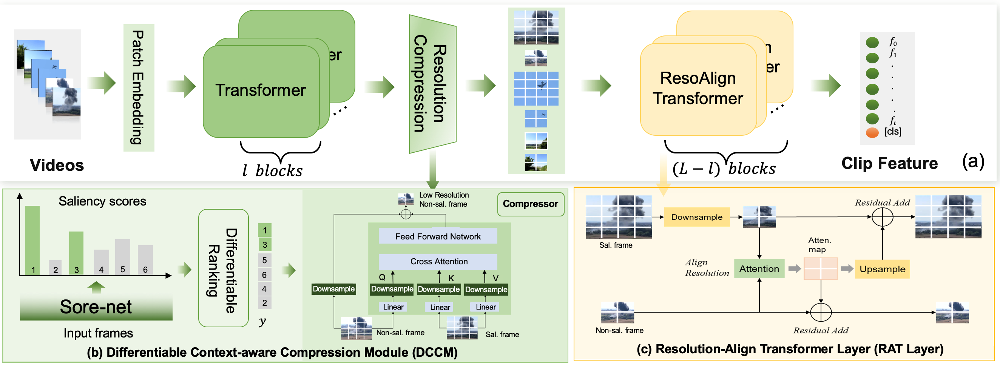

# Differentiable Resolution Compression and Alignment for Efficient Video Classification and Retrieval

This is an official pytorch implementation of paper "Differentiable Resolution Compression and Alignment for Efficient Video Classification and Retrieval".  This repository provides code for training and evaluation.  Also, the code and pretrained weights of video classification are available to facilitate the reproduction of the paper's results.  The code and pretrained weights of video retrieval will coming soon.

<p align="center">

</p>


## Installation
Requirements
+ python==3.8
+ torch==1.10.2
+ torchvision==0.11.3
+ mmaction2==0.24.0
+ mmcv==1.5.2 


## Dataset Preparation
### Mini-Kinetics
+ **Video**: We download video using tools from this project [kinetics-dataset](https://github.com/cvdfoundation/kinetics-dataset) and extract rgb frame from video with [extract_rgb_frames.sh](https://github.com/open-mmlab/mmaction2/blob/0.x/tools/data/kinetics/extract_rgb_frames.sh).
+ **Annotation**: We obtain annotation from [AR-Net](https://github.com/mengyuest/AR-Net) and convert it into mmAction format. The converted annotations can be found in [`data/mini-kinetics`](https://drive.google.com/drive/folders/1BhlFFKEWX4k9vpfNQ_-FhyOJsu39cG86?usp=drive_link).


## Pretrained Model
You can download the pretrained weights on [Google Drive](https://drive.google.com/drive/folders/1XXbu1iS32OKlonAeLDUs3GY2ynHNTNLr?usp=drive_link).

## Training
```shell
# default config of DRCA on Mini-Kinetics dataset
python -m torch.distributed.launch --nproc_per_node=8 tools/train.py  configs/DRCA-S-K4-224.py  


#The ablation study of DCCM under different sampling strategies and compression modules can be reproduced with the following args:
# model.backbon.comp_strategy: ["diff_rank", "uniform", "wo_diff_rank"]
# model.backbon.comp_module: ['sal_ref', 'conv2d', 'conv3d', 'patch_merge', 'resblock_2d', 'resblock_3d']
# Usage:
python -m torch.distributed.launch --nproc_per_node=8 tools/train.py  configs/DRCA-S-K4-224.py  \
    --cfg-options work_dir="work_dirs/DRCA/DRCA-S-K4-224-conv2d" \
        model.backbon.comp_strategy="diff_rank" \
        model.backbon.comp_module="resblock_3d"
```


## Evaluation 
```shell
# evaluation on Mini-Kinetics dataset
python -m torch.distributed.launch --master_port 55 --nproc_per_node=8 tools/test.py \
     configs/DRCA-S-K2-224.py  weights/DRCA-S-K4-224-minik.pth -la pytorch --out outputs/DRCA-S-K2-224-test


# compute GFlops
python tools/get_flops.py  configs/DRCA-S-K4-224.py --shape 1 3 8 224 224 
```

## License
This project is licensed under the Apache License 2.0 - see the [LICENSE](LICENSE) file for details.

